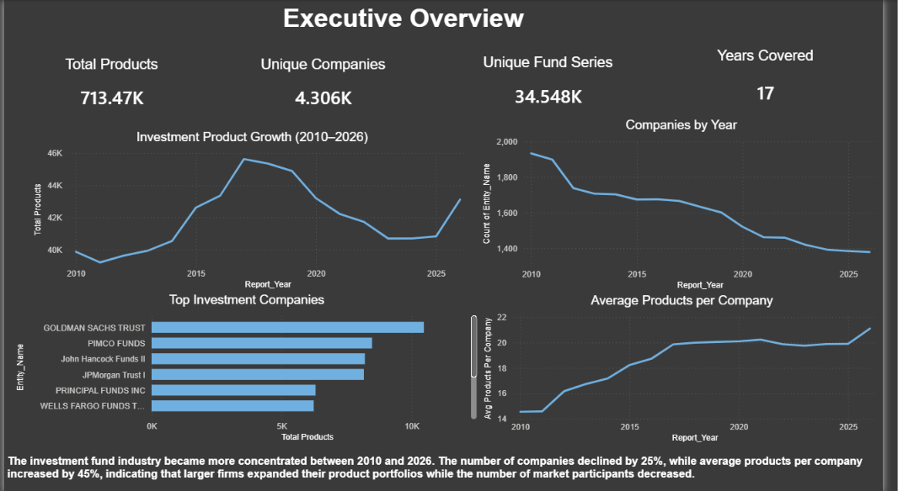
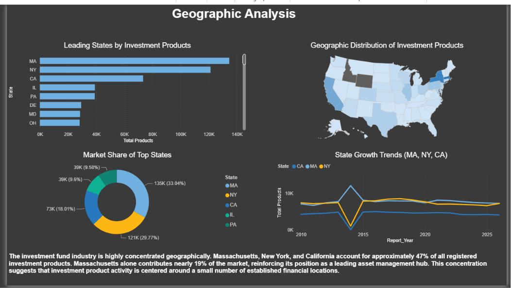
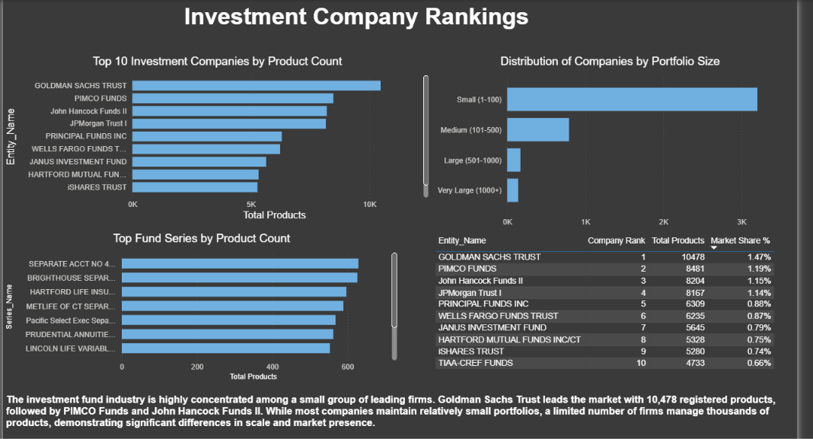

# Investment Company Analysis (2010–2026)

## Project Summary

This project analyzes the U.S. investment fund industry using SEC Investment Company Series and Class data from 2010 to 2026.

Using Python, SQL Server, and Power BI, an end-to-end analytics solution was developed to transform raw SEC datasets into actionable business insights. The project explores industry growth, market concentration, geographic distribution, and market leadership trends across more than 713,000 investment product records.

---

## Portfolio Project

### Author

**Jumma Mohammad**

GitHub Portfolio:
https://github.com/jumma786

LinkedIn:
https://www.linkedin.com/in/jumma-mohammad/

Project Repository:
https://github.com/jumma786/investment-company-analysis

Email:
[jummamohammad477@gmail.com](mailto:jummamohammad477@gmail.com)

---

## Business Problem

The investment fund industry has experienced significant changes over the past decade.

This project investigates:

* How investment products evolved over time
* Whether the number of investment companies increased or decreased
* Which firms dominate the market
* Where investment products are geographically concentrated
* Whether the industry is becoming more concentrated

---

## Project Objectives

* Analyze investment product growth from 2010–2026
* Evaluate trends in company participation
* Identify leading investment companies
* Examine geographic concentration across U.S. states
* Measure industry concentration and portfolio expansion
* Develop an interactive business intelligence dashboard

---

## Dataset

### Source

U.S. Securities and Exchange Commission (SEC)

[https://www.sec.gov/file/investment-company-series-and-class-information-downloads](https://www.sec.gov/data-research/sec-markets-data/investment-company-series-class-information)


### Coverage

* Period: 2010–2026
* Records Analyzed: 713,468
* Final Dataset Columns: 15

### Key Fields

* Investment Company Name
* Series ID
* Series Name
* Class ID
* Class Name
* Class Ticker
* State
* City
* Report Year

---

## Dataset Availability

The processed dataset (`investment_products_gold.csv`) exceeds GitHub's file size limit and is therefore excluded from this repository.

The dataset can be recreated using the ETL scripts included in the project together with the SEC source files.

---

## Technology Stack

### Python

* Pandas
* NumPy
* SQLAlchemy
* PyODBC

### SQL Server

* SQL Server Express
* SQL Server Management Studio (SSMS)

### Business Intelligence

* Power BI

### Version Control

* Git
* GitHub

---

## Data Pipeline

### Step 1 – Data Collection

Collected annual SEC Investment Company Series and Class datasets from 2010 through 2026.

### Step 2 – Data Cleaning

* Standardized column names
* Removed invalid records
* Fixed schema inconsistencies
* Consolidated yearly datasets

### Step 3 – Gold Dataset Creation

Created a consolidated analytical dataset:

```text
investment_products_gold.csv
```

Dataset Size:

```text
713,468 Rows
15 Columns
```

### Step 4 – SQL Analysis

Imported the cleaned dataset into SQL Server and performed business and advanced analytical queries.

### Step 5 – Power BI Dashboard Development

Developed a multi-page Power BI dashboard to visualize trends and communicate business insights.

---

## Dashboard Preview

### Page 1 – Executive Overview



### Page 2 – Geographic Analysis



### Page 3 – Market Leaders Analysis



---

## Key Findings

### Industry Growth

* Investment products increased from **39,867** in 2010 to **43,121** in 2026.

### Company Participation

* Investment companies declined from **2,737** to **2,044**.
* Represents approximately a **25% decrease**.

### Industry Concentration

* Average products per company increased from **14.6** to **21.1**.
* Indicates increasing market concentration.

### Geographic Concentration

Top states by product count:

1. Massachusetts
2. New York
3. California

### Market Leaders

Leading investment companies include:

* Goldman Sachs Trust
* PIMCO Funds
* John Hancock Funds II
* JPMorgan Trust I
* Principal Funds Inc.

---

## SQL Analysis

Topics Covered:

* Aggregations
* GROUP BY Analysis
* Window Functions
* Ranking Functions
* Growth Rate Analysis
* Market Share Analysis
* Portfolio Concentration Analysis
* Industry Trend Analysis

---

## Detailed Project Report

A comprehensive report containing methodology, findings, business implications, dashboard analysis, and conclusions is available below:

📄 **[View Full Project Report](docs/project_report.md)**

---

## Repository Structure

```text
investment-company-analysis
│
├── data
│   └── raw
│
├── docs
│   └── project_report.md
│
├── powerbi
│   ├── Investment_Company_Analysis.pbix
│   ├── page1_executive_overview.png
│   ├── page2_geographic_analysis.png
│   └── page3_market_leaders.png
│
├── scripts
│   ├── build_gold.py
│   ├── check_headers.py
│   └── import_to_sql.py
│
├── sql
│   ├── 01_create_database.sql
│   ├── 02_create_table.sql
│   ├── 03_bulk_import.sql
│   ├── 04_business_analysis.sql
│   └── 05_advanced_analysis.sql
│
├── README.md
├── requirements.txt
└── .gitignore
```

---

## Skills Demonstrated

* Data Cleaning
* ETL Development
* Data Transformation
* SQL Analytics
* Advanced SQL
* Power BI Dashboarding
* Data Visualization
* Business Intelligence
* Business Storytelling
* Git & GitHub

---

## Conclusion

The U.S. investment fund industry experienced significant consolidation between 2010 and 2026.

While investment products increased from 39,867 to 43,121, the number of participating companies declined by approximately 25%. As a result, the average number of products managed per company increased substantially, indicating growing market concentration.

This project demonstrates how Python, SQL Server, and Power BI can be combined to build an end-to-end analytics solution capable of transforming large-scale regulatory data into meaningful business insights.


